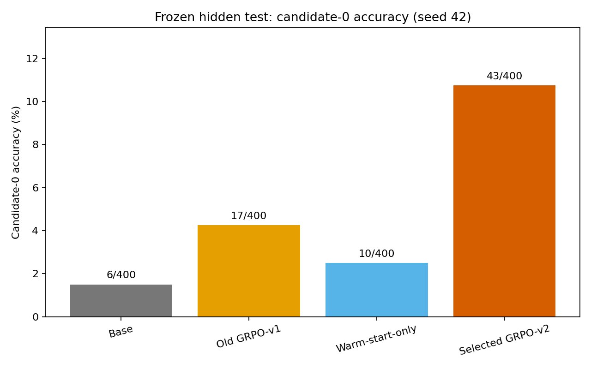
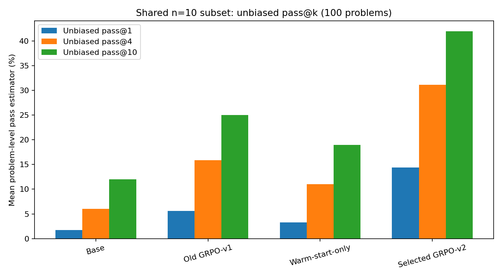
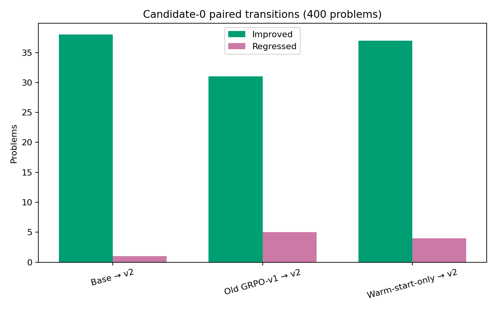
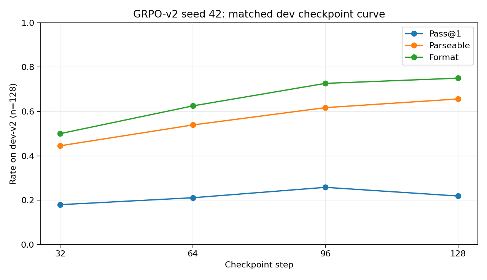

# GRPO-v2 Math RLVR at 1.5B

**Artifact-first reinforcement learning for verifiable mathematical reasoning: from a matched PPO/GRPO study to a preregistered warm-start + GRPO-v2 improvement run.**

> On one frozen seed-42 hidden-test protocol, selected GRPO-v2 reached **43/400 (10.75%)** candidate-0 accuracy, versus **6/400 (1.50%)** for Base and **17/400 (4.25%)** for old GRPO-v1. That is **+9.25 pp** over Base and **+6.50 pp** over GRPO-v1. On the shared n=10 pool, GRPO-v2 reached **42.00% unbiased pass@10**.

This is a **single-seed, preregistered paired result**, not evidence of universal algorithm superiority. MATH Level 1 has only three hidden problems. The hidden test was opened once, after dev-only checkpoint selection, and never used for tuning or retraining.



## Results

### Frozen four-model hidden test

| Model state | Candidate-0 accuracy, all 400 | Unbiased pass@1, shared 100 | Unbiased pass@4 | Unbiased pass@10 | Format | Parseable | Truncated |
|---|---:|---:|---:|---:|---:|---:|---:|
| Base | 6/400 (1.50%) | 1.70% | 6.03% | 12.00% | 7.75% | 7.00% | 10.75% |
| Old GRPO-v1 | 17/400 (4.25%) | 5.60% | 15.87% | 25.00% | 21.25% | 17.00% | 11.00% |
| Warm-start-only | 10/400 (2.50%) | 3.30% | 11.03% | 19.00% | 12.00% | 10.25% | 11.50% |
| Selected GRPO-v2 | 43/400 (10.75%) | 14.40% | 31.14% | 42.00% | 58.75% | 48.50% | 8.50% |

Candidate-0 accuracy is the primary metric: one fixed candidate for every one of 400 problems. The pass@k metrics are separate inference-scaling estimates on the same fixed 100-problem subset. Each subset problem has one exchangeable n=10 candidate batch; if `c` candidates are correct, `pass_hat(k) = 1 - C(10-c,k)/C(10,k)`. Candidate 0 belongs to that batch, but 400-problem candidate-0 accuracy and 100-problem unbiased pass@1 have different problem universes and are not interchangeable.



### Paired candidate-0 changes

| Comparison | Delta | Improved / regressed | Paired bootstrap 95% CI | Exact McNemar p |
|---|---:|---:|---:|---:|
| Base → Old GRPO-v1 | +2.75 pp | 11 / 0 | [+1.25, +4.50] pp | 0.000977 |
| Base → Warm-start-only | +1.00 pp | 4 / 0 | [+0.25, +2.00] pp | 0.125 |
| Base → Selected GRPO-v2 | +9.25 pp | 38 / 1 | [+6.50, +12.25] pp | 1.46e-10 |
| Old GRPO-v1 → Selected GRPO-v2 | +6.50 pp | 31 / 5 | [+3.75, +9.50] pp | 1.29e-05 |
| Warm-start-only → Selected GRPO-v2 | +8.25 pp | 37 / 4 | [+5.25, +11.25] pp | 1.03e-07 |

Warm-start-only improved output protocol adherence but produced only 10/400 canonical successes. Selected GRPO-v2 improved both strict format/parseability and canonical correctness relative to warm-start, supporting an incremental RLVR contribution under this frozen protocol.



## Project evolution

| Stage | What it established | Held-out result |
|---|---|---|
| Portfolio v1 Base | Frozen Qwen2.5-1.5B reference | 4.00% pass@1 on the v1 test |
| Portfolio v1 PPO | Value-model PPO under matched 32-update budget | 3.75% pass@1 on the v1 test |
| Portfolio v1 GRPO | Group-relative optimization without a value model | 7.00% pass@1 on the v1 test |
| GRPO-v2 warm-start | One epoch over 256 trusted format/solution targets | 2.50% candidate-0 on the new disjoint hidden test |
| GRPO-v2 RLVR | 128 updates over 512 unique prompts, initialized from warm-start | **10.75% candidate-0 on the new disjoint hidden test** |

The v1 and v2 percentages above come from different held-out test identities; they must not be directly subtracted. The valid v2 improvement comparisons are the four-model rows evaluated together on the new hidden test, including old GRPO-v1 at 4.25%.

## GRPO-v2 method

- **Base:** `Qwen/Qwen2.5-1.5B-Instruct`, revision `989aa7980e4cf806f80c7fef2b1adb7bc71aa306`, BF16, local-only.
- **Warm-start:** 256 samples, one epoch, completion-only supervision, 16 optimizer steps; policy LoRA r16/alpha32/dropout0 on q/k/v/o.
- **RLVR:** 512 unique prompts, 128 updates, four completions per prompt, 2,048 rollout completions, 230,675 generated tokens.
- **Reward:** strict output-format and valid-answer shaping plus canonical correctness; model text is parsed as data and never executed.
- **Learning signal:** 367/512 prompt groups had nonzero within-group reward variance; 145 were zero-advantage.
- **Checkpoints:** 32/64/96/128. Only dev-v2 selected the final checkpoint.

### Dev-only checkpoint selection

| Step | Canonical pass@1 | Parseable | Format | Truncated |
|---:|---:|---:|---:|---:|
| 32 | 23/128 (17.9688%) | 44.5312% | 50.0000% | 5.4688% |
| 64 | 27/128 (21.0938%) | 53.9062% | 62.5000% | 3.9062% |
| 96 | 33/128 (25.7812%) | 61.7188% | 72.6562% | 3.1250% |
| 128 | 28/128 (21.8750%) | 65.6250% | 75.0000% | 3.9062% |

The preregistered lexicographic rule selected **checkpoint-96** because it had the highest canonical dev pass@1: 33/128 (25.78125%). Step 128 improved format and parseability but fell to 28/128 canonical successes. The hidden test did not participate in selection.



## Data split and leakage prevention

- `train_v2`: 512 unique problems; GSM8K 256 and MATH Levels 1/2/3 = 64/96/96.
- `warmstart_v2`: a declared 256-problem subset of train-v2.
- `dev_v2`: 128 problems; used only for diagnosis and checkpoint selection.
- `test_v2_hidden`: 400 problems; GSM8K 200 and MATH500 200 with levels 3/33/43/59/62.
- Shared pass@k subset: 100 hidden problems with one frozen n=10 candidate schedule.
- Content-hash and source-ID overlap is zero across train/dev/test and all v1 manifests, except the explicitly declared warm-start and pass@k subsets.
- Hidden-test outputs cannot trigger tuning, checkpoint reselection, prompt/reward changes, or another run.

See the [data freeze report](reports/grpo_v2/data_freeze_report.md), [leakage audit](reports/grpo_v2/data_leakage_audit.json), and [pass@k contract](reports/grpo_v2/pass_k_contract.md).

## Evidence-backed figures

Every image below has committed CSV/JSON sources recorded in [figure_sources.json](reports/grpo_v2/portfolio/figure_sources.json).

| Question | Figure |
|---|---|
| Candidate-0 four-model result | [accuracy](reports/grpo_v2/hidden_test_final/figures/candidate0_accuracy.png) |
| Shared unbiased pass@1/@4/@10 | [pass@k](reports/grpo_v2/hidden_test_final/figures/unbiased_pass_k.png) |
| Format, parseability, truncation | [protocol behavior](reports/grpo_v2/hidden_test_final/figures/protocol_metrics.png) |
| Dev checkpoint selection | [dev curve](reports/grpo_v2/grpo_v2_training/grpo_v2_seed42_20260726T044303Z/figures/dev_checkpoint_curve.png) |
| Reward and canonical pass by update | [training reward](reports/grpo_v2/grpo_v2_training/grpo_v2_seed42_20260726T044303Z/figures/training_reward.png) |
| Group variance and zero advantage | [reward-group signal](reports/grpo_v2/grpo_v2_training/grpo_v2_seed42_20260726T044303Z/figures/reward_group_signal.png) |
| Completion length and truncation | [length/truncation](reports/grpo_v2/grpo_v2_training/grpo_v2_seed42_20260726T044303Z/figures/completion_length_truncation.png) |
| GSM8K versus MATH500 | [dataset results](reports/grpo_v2/hidden_test_final/figures/per_dataset_accuracy.png) |
| MATH Level 1–5 with denominators | [MATH levels](reports/grpo_v2/hidden_test_final/figures/math_level_accuracy.png) |
| Paired improvements/regressions | [transitions](reports/grpo_v2/hidden_test_final/figures/paired_transitions.png) |
| Quality versus evaluation cost | [cost/quality](reports/grpo_v2/hidden_test_final/figures/cost_quality_tradeoff.png) |
| VRAM/utilization timeline | [resources](reports/grpo_v2/grpo_v2_training/grpo_v2_seed42_20260726T044303Z/figures/resource_timeline.png) |

## Resources and cost

- Warm-start plus GRPO-v2 **training-only telemetry:** 0.299755 GPU-hours, ¥2.6618.
- Four-model hidden evaluation: 1.980286 GPU-hours, ¥17.5849, 606,487 generated tokens, peak 5,321 MiB.
- Minimum confirmed non-overlapping components: 2.465931 GPU-hours, ¥21.8975; this excludes unseparated checkpoint-dev and IPC-idle components.
- Full observed instance scope: 3.566266 GPU-hours, ¥31.6684. This substitutes the full GRPO-v2 launcher wall for its overlapping training-only row.
- Checkpoint-dev-only and IPC-idle-only costs are **unavailable**, not zero, because the recorded full launcher wall combines dev, finalization, and IPC waiting.

Machine-readable ledger: [CSV](reports/grpo_v2/portfolio/cost_ledger.csv) · [JSON](reports/grpo_v2/portfolio/cost_ledger.json).

## What the result supports

1. Format/solution warm-start improved protocol compliance enough to provide a viable RL initialization, but did not itself establish a reliable canonical-accuracy gain.
2. GRPO-v2 added a large paired improvement over both Base and warm-start under this seed/protocol.
3. Expanded training coverage, a deterministic curriculum, completion-only warm-start, and dev-only selection are plausible contributors; this experiment does not isolate each design choice causally.
4. Engineering and scientific states are separate: zero-update failures stay excluded, while a launcher IPC failure after finalized training does not erase complete primary evidence.

## Limitations

- One training seed and one 1.5B model; no multi-seed or cross-model generality claim.
- Only 512 RL prompts and 128 updates.
- MATH Level 1 has only 3 hidden problems and is diagnostic only.
- Candidate-0 accuracy over 400 problems and unbiased pass@k over 100 problems have different universes.
- Some optional TRL telemetry is unavailable; missing values remain null with reasons.
- Test was opened once and cannot be used for further tuning or retraining.
- The v1 and v2 hidden test identities differ; cross-version raw percentages are descriptive, not paired deltas.

## Reproduction and safety

Start with [reproducibility](docs/reproducibility.md), the [GRPO-v2 roadmap](docs/grpo_v2_roadmap.md), and the exact checked-in configs under [`configs/grpo_v2/`](configs/grpo_v2/). CPU-only identity checks:

```bash
PYTHONPATH=src python scripts/check_env.py
PYTHONPATH=src python scripts/validate_manifests.py
```

Real model commands in the reports are provenance templates, **not authorization to spend GPU resources**. The project uses offline, pinned snapshots; adapter-only checkpoints; AST/Fraction and canonical math verification; no `eval`/`exec`; and no model/cache/credential files in Git.

## Reports and artifact index

- [Final four-model comparison](reports/grpo_v2/hidden_test_final/final_comparison.md)
- [GRPO-v2 training report](reports/grpo_v2/grpo_v2_training/grpo_v2_seed42_20260726T044303Z/report.md)
- [Base metric recovery](reports/grpo_v2/base_hidden_recovery/report.md)
- [Error analysis](reports/grpo_v2/hidden_test_final/error_analysis.md) and [mechanical case studies](reports/grpo_v2/hidden_test_final/case_studies.md)
- [GRPO-v2 roadmap](docs/grpo_v2_roadmap.md)
- [Interview guide](docs/interview_guide.md)
- [200道中文面试问答](docs/INTERVIEW_200_QA_ZH.md)
- [Portfolio deliverables](docs/PORTFOLIO_DELIVERABLES.md)
- [Release manifest](release/grpo_v2_release_manifest.json)
- [Remote-only checkpoints and run archives](release/remote_artifacts.md)
- Portfolio v1 remains frozen at tag `v0.1.0-formal-rlvr`.

No license has been selected; this repository intentionally contains no `LICENSE` file.
