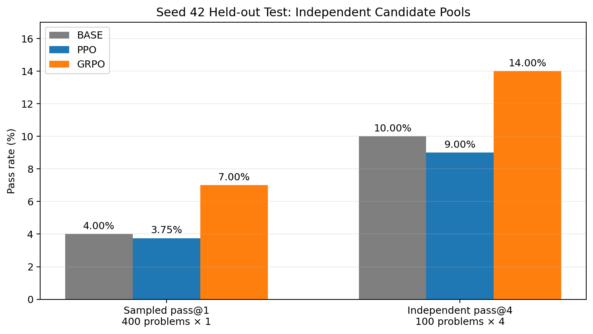
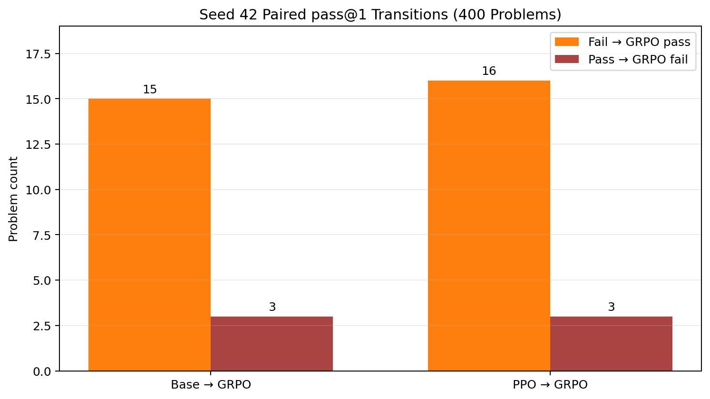
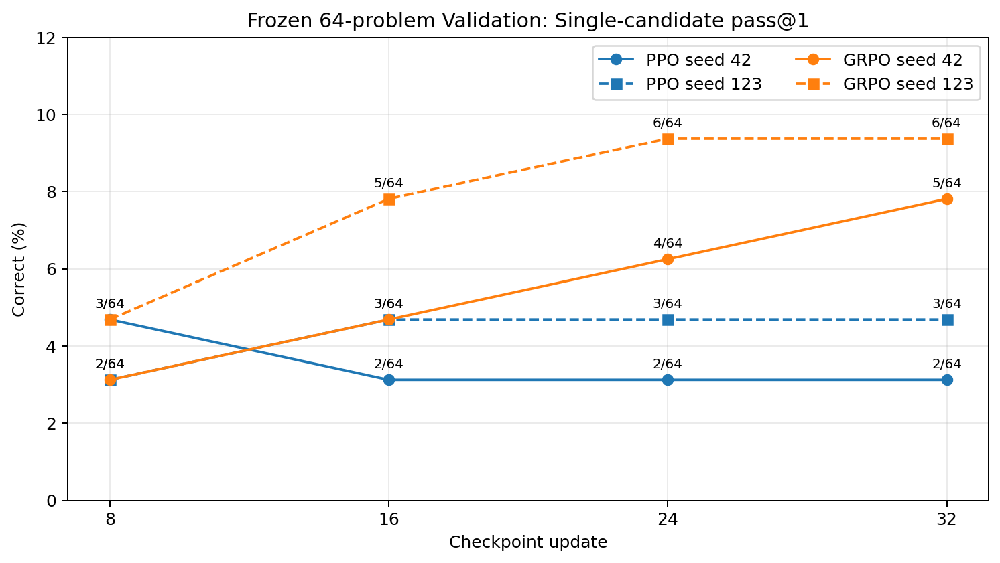

# PPO vs GRPO for Few-Shot Math RLVR at 1.5B: Sample Efficiency, Stability, and Generalization

Artifact-first, reproducible reinforcement learning with verifiable rewards (RLVR) on `Qwen/Qwen2.5-1.5B-Instruct`.

> Under the same model, data, prompt, policy LoRA, sampling, reward, parser/verifier, 32-update, 512-completion, and token budgets, GRPO raised seed-42 held-out pass@1 from 4.0% (Base) to 7.0%, while PPO reached 3.75%; GRPO also used substantially less peak VRAM and lower training-plus-validation cost.

This headline is a **single-seed paired result**. GRPO's validation direction is consistent across seeds 42 and 123, but GRPO123 and PPO123 final tests are `deferred_not_executed`. The evidence does not establish universal algorithm superiority.

## Results at a glance

The final protocol uses independent candidate pools: pass@1 evaluates 400 problems once; pass@4 evaluates a fixed, separate 100-problem subset with four candidates each. They are not nested metrics.

| Seed-42 held-out test | Base | PPO checkpoint-32 | GRPO checkpoint-32 |
|---|---:|---:|---:|
| Sampled pass@1 | 16/400 (4.00%) | 15/400 (3.75%) | 28/400 (7.00%) |
| Independent pass@4 | 10/100 (10.00%) | 9/100 (9.00%) | 14/100 (14.00%) |
| Format-valid candidates | 13.50% | 14.00% | 24.50% |
| Parseable candidates | 12.00% | 12.25% | 20.25% |
| Truncated candidates | 10.00% | 10.00% | 8.00% |

| Paired seed-42 pass@1 comparison | Delta | Improved / regressed | Paired bootstrap 95% CI | Exact McNemar p |
|---|---:|---:|---:|---:|
| Base → GRPO | +3.00 pp | 15 / 3 | [+1.00, +5.00] pp | 0.00754 |
| PPO → GRPO | +3.25 pp | 16 / 3 | [+1.25, +5.50] pp | 0.00443 |

Pass@4 deltas are positive (+4 pp vs Base; +5 pp vs PPO), but both confidence intervals cross zero. They are reported as an encouraging trend, not a confirmed improvement.





### Two-seed checkpoint validation

Each validation point is one frozen candidate for each of 64 held-out validation problems. The step-32 results are PPO42 2/64, PPO123 3/64, GRPO42 5/64, and GRPO123 6/64.



| Formal run | Step-32 validation | Peak VRAM | GPU-hours | Cost (CNY, ¥8.88/GPU-h) |
|---|---:|---:|---:|---:|
| PPO seed 42 | 2/64 | 51.9 GiB | 0.4802 | ¥4.26 |
| PPO seed 123 | 3/64 | 52.6 GiB | 0.4262 | ¥3.78 |
| GRPO seed 42 | 5/64 | 10.9 GiB | 0.3305 | ¥2.93 |
| GRPO seed 123 | 6/64 | 8.5 GiB | 0.3094 | ¥2.75 |

Resource rows include formal training plus the four checkpoint validations. PPO42 validation was recovered in separate processes after a cadence bug, so its wall-time scope is disclosed rather than treated as identical process overhead.

## Evidence-backed figures

Every portfolio figure is rebuilt by [`scripts/build_portfolio_v1.py`](scripts/build_portfolio_v1.py) from committed CSV/JSON—not from chat text or hand-entered chart values.

| Question | Figure |
|---|---|
| Final Base/PPO/GRPO pass@1 and pass@4 | [held-out pass metrics](reports/formal_1p5b/figures/portfolio_final_pass_metrics.png) |
| Paired improvements and regressions | [paired transitions](reports/formal_1p5b/figures/portfolio_paired_transitions.png) |
| PPO/GRPO validation by checkpoint | [validation curves](reports/formal_1p5b/figures/portfolio_validation_curves.png) |
| Four-run reward and canonical pass | [training curves](reports/formal_1p5b/figures/portfolio_training_curves.png) |
| GRPO within-group learning signal | [reward-group variance](reports/formal_1p5b/figures/portfolio_reward_group_variance.png) |
| Format, parseability, and truncation | [output behavior](reports/formal_1p5b/figures/portfolio_format_parseable_truncation.png) |
| Peak memory | [VRAM comparison](reports/formal_1p5b/figures/portfolio_peak_vram.png) |
| Wall time, GPU-hours, and cost | [resource comparison](reports/formal_1p5b/figures/portfolio_resource_costs.png) |
| MATH500 Level 1–5 | [difficulty breakdown](reports/formal_1p5b/figures/portfolio_math500_levels.png) |
| Canonical verifier outcomes | [RewardStatus distribution](reports/formal_1p5b/figures/portfolio_reward_status.png) |

## Fair comparison contract

- **Model:** `Qwen/Qwen2.5-1.5B-Instruct`, revision `989aa7980e4cf806f80c7fef2b1adb7bc71aa306`, BF16, local-only.
- **Data:** identical frozen GSM8K/MATH training and 64-problem validation manifests; MATH500 is held out from training.
- **Prompt:** `prompt_v2_formal_math`; one system/user chat followed by an open assistant turn.
- **Output:** one `<reasoning>...</reasoning>` block followed by one terminal `<answer>...</answer>` block.
- **Reward:** `shaped_v3_domain`: answer block 0.05, strict protocol 0.05, domain-valid answer 0.10, canonical correctness 0.80.
- **Verification:** shared strict parser plus canonical GSM8K/MATH verifier; infrastructure errors fail closed.
- **Policy LoRA:** r=16, alpha=32, dropout=0 on q/k/v/o. PPO additionally requires its algorithm-specific value adapter/head.
- **Sampling:** temperature 0.8, top-p 0.95, 832 prompt tokens, 256 completion tokens.
- **Budget:** 32 updates, 512 training completions, 131,072 generated-token hard cap, checkpoint/validation at 8/16/24/32.
- **Final test:** fixed checkpoint-32 only; 400×1 pass@1 pool plus an independent fixed 100×4 pass@4 pool.
- **No leakage:** test is never used for prompt changes, tuning, stopping, or checkpoint selection.

See [experiment design](docs/experiment_design.md), [methodology](docs/methodology.md), and the frozen [experiment plan](reports/formal_1p5b/experiment_plan.md).

## Reproduce the workflow

Install the pinned environment from [`pyproject.toml`](pyproject.toml), prepare the datasets documented in [REPRODUCIBILITY.md](REPRODUCIBILITY.md), and keep model caches/runs outside the repository.

```bash
python -m venv .venv
source .venv/bin/activate
pip install -e ".[dev]"

PYTHONPATH=src python scripts/check_env.py
PYTHONPATH=src python scripts/validate_manifests.py

# CPU-only preflight: omit --execute and confirmation.
PYTHONPATH=src python -m math_rlvr.training.ppo \
  --config configs/formal_1p5b/resolved/ppo_seed_42.json
PYTHONPATH=src python -m math_rlvr.training.grpo \
  --config configs/formal_1p5b/resolved/grpo_seed_42.json
```

Real paid runs require explicit authorization, an exact local snapshot, a clean worktree, and both offline variables:

```bash
HF_HUB_OFFLINE=1 TRANSFORMERS_OFFLINE=1 PYTHONPATH=src \
python -m math_rlvr.training.ppo \
  --config configs/formal_1p5b/resolved/ppo_seed_42.json \
  --execute --confirm-formal-ppo

HF_HUB_OFFLINE=1 TRANSFORMERS_OFFLINE=1 PYTHONPATH=src \
python -m math_rlvr.training.grpo \
  --config configs/formal_1p5b/resolved/grpo_seed_42.json \
  --execute --confirm-formal-grpo
```

Checkpoint validation and final evaluation use placeholders rather than private run IDs:

```bash
HF_HUB_OFFLINE=1 TRANSFORMERS_OFFLINE=1 PYTHONPATH=src \
python -m math_rlvr.evaluation.formal \
  --config configs/formal_1p5b/evaluation.json \
  --phase validation --algorithm <ppo|grpo> --seed <SEED> --mode <ppo|grpo> \
  --checkpoint-step <8|16|24|32> --checkpoint <TRUSTED_CHECKPOINT_DIR> \
  --run-dir <NEW_VALIDATION_RUN_DIR> --execute --confirm-formal-evaluation

HF_HUB_OFFLINE=1 TRANSFORMERS_OFFLINE=1 PYTHONPATH=src \
python -m math_rlvr.evaluation.formal \
  --config configs/formal_1p5b/evaluation.json \
  --phase final --algorithm <ppo|grpo> --seed <SEED> --mode <ppo|grpo> \
  --checkpoint-step 32 --checkpoint <TRUSTED_CHECKPOINT_32> \
  --run-dir <NEW_FINAL_RUN_DIR> --execute --confirm-formal-evaluation

python scripts/build_portfolio_v1.py
```

Exact same-run resume is restricted to project-created checkpoints whose run/config/model/suite identities and manifest hashes match. Use `--resume-checkpoint <TRUSTED_SAME_RUN_CHECKPOINT>` only with the original training command and never deserialize external checkpoints. See [checkpoint safety](docs/checkpoint-safety.md).

## Safety and artifact integrity

Generated model text is parsed as data and never executed. The verifier uses AST/Fraction-based arithmetic and `math-verify`; it does not use `eval`, `exec`, dynamic imports, generated-code execution, or subprocess execution. The pipeline does not require Docker or Modal. Credentials, environment dumps, Hugging Face cache, base weights, full checkpoints, optimizer state, and large run archives are excluded from Git. Public summaries use `null`/`available=false`/reason for unavailable metrics—never invented zeros.

Browse the [artifact index](ARTIFACT_INDEX.md), [release manifest](release/portfolio_v1_manifest.json), [reproducibility guide](REPRODUCIBILITY.md), and [engineering postmortem](docs/engineering_postmortem.md).

## Limitations

- The policy is only 1.5B parameters and each run uses 32 updates / 512 training completions.
- Validation contains 64 problems; integer counts matter more than smooth-looking percentages.
- Only seed 42 has the complete Base/PPO/GRPO final-test comparison. Seed-123 final evaluations are `deferred_not_executed`.
- Pass@1 and pass@4 use independent candidate pools and cannot be treated as nested.
- PPO and GRPO losses are algorithm-specific; native entropy definitions are not directly comparable across algorithms.
- Two training seeds do not support a general statistical-significance claim.
- Held-out test results may not be used to tune the proposed GRPO-v2 phase.
- Some optional TRL telemetry is unavailable and is explicitly represented as such.

Full caveats: [docs/limitations.md](docs/limitations.md).

## Project map

- [`src/math_rlvr/`](src/math_rlvr/) — prompt, rewards, verifiers, training/evaluation entry points, accounting, and artifact contracts.
- [`configs/formal_1p5b/`](configs/formal_1p5b/) — frozen model, data, training, and evaluation identities.
- [`reports/formal_1p5b/`](reports/formal_1p5b/) — reports, machine-readable metrics, figures, checksums, and run registry.
- [`reports/formal_1p5b/13_seed42_final_comparison.md`](reports/formal_1p5b/13_seed42_final_comparison.md) — complete seed-42 final comparison.
- [`docs/interview_guide.md`](docs/interview_guide.md) — concise technical discussion guide.
- [`release/remote_artifacts.md`](release/remote_artifacts.md) — large artifacts retained outside GitHub.

No license has been selected for this repository; no `LICENSE` file is included.

## GRPO-v2 preregistered improvement branch

The `improve/grpo-v2` branch freezes a seed-42 **format/solution warm-start + GRPO-v2 RLVR** protocol. Warm-start and matched dev have run; GRPO-v2 and hidden test have not. It expands RL coverage to 512 unique prompts and 128 updates while retaining the v1 model, prompt, reward, parser/verifier, sampling, LoRA, and 256-token completion cap. The hidden test is strictly disjoint from all v1/core data and uses a genuine nested pass@4 pool. See the [design decision](reports/grpo_v2/design_decision.md), [data freeze](reports/grpo_v2/data_freeze_report.md), and [roadmap](docs/grpo_v2_roadmap.md). Portfolio-v1 results remain unchanged.

Stage O.2 completed the tokenizer/runtime gate. The original 256-token target audit failure is disclosed; the capacity-only amendment uses 928 prompt / 640 active-target gates while retaining the 1,088 actual-sequence ceiling. All 256 amended records pass without truncation, and the guarded warm-start later completed successfully. Secondary nested pass@10 is preregistered as exploratory only.

Stage O.3 supersedes the unexecuted 50-problem pass@10 proposal with a shared 100-problem n=10 contract. Future hidden evaluation reports separate 400-problem candidate-0 accuracy from exact unbiased pass@1/pass@4/pass@10 over the unchanged shared subset; no hidden-test generation has run. See the [pass@k contract](reports/grpo_v2/pass_k_contract.md) and [amendment](reports/grpo_v2/evaluation_contract_amendment.md).

### GRPO-v2 Stage P status

The seed-42 warm-start [`warmstart_grpo_v2_seed42_20260722T051218Z`](reports/grpo_v2/warmstart/warmstart_grpo_v2_seed42_20260722T051218Z/report.md) completed its exact 256-sample/one-epoch/16-step contract and produced a verified adapter-only checkpoint. Base and warm-start matched dev-v2 evaluations subsequently completed at 6/128 and 8/128. GRPO-v2 and hidden test have not started.

### Stage P.1 evaluator status

A single guarded matched dev-v2 evaluator is frozen for the 128-problem Base versus warm-start comparison. It uses identical candidate-0 sampling and evidence identities in both modes; warm-start is bound to the immutable checkpoint-16 adapter. Both matched runs completed once. GRPO-v2 and hidden test remain unexecuted.

### GRPO-v2 matched dev result

The frozen matched evaluation completed once per mode: Base achieved 6/128 candidate-0 pass@1 and warm-start 8/128. Format validity improved from 17/128 to 23/128. Five problems improved and three regressed; the +1.5625 pp paired delta has a bootstrap 95% interval of [-2.34375,+6.25] pp, so it is an uncertain dev-only gain rather than evidence of hidden-test superiority. [Full results](reports/grpo_v2/stage_p1_dev_results.md). GRPO-v2 and hidden test have not started.


### GRPO-v2 Stage Q runtime freeze

The guarded model-bound seed-42 runtime is now CPU/fake validated. It loads only the immutable warm-start policy adapter, initializes a fresh GRPO optimizer/scheduler, enforces 128 updates/512 microsteps/2,048 completions and writes adapter-only trusted checkpoints plus independent dev evaluations at 32/64/96/128. Hidden test remains sealed. The exact future command is in [`docs/NEXT_TASK.md`](docs/NEXT_TASK.md); no GRPO-v2 GPU run has started.
