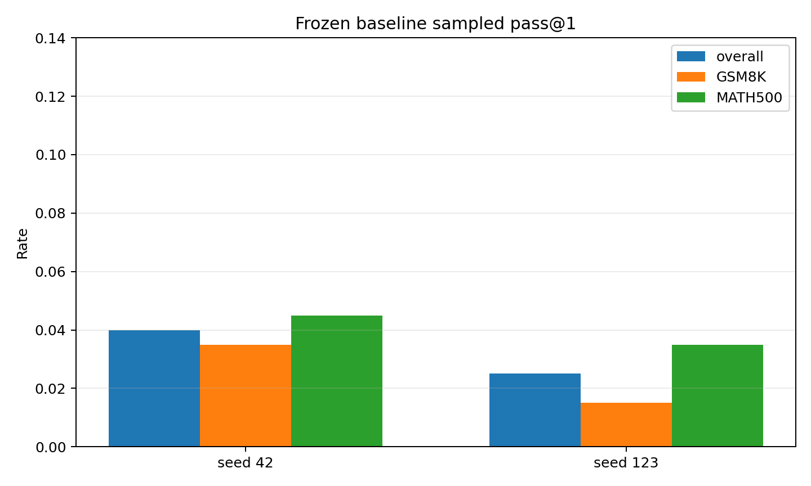
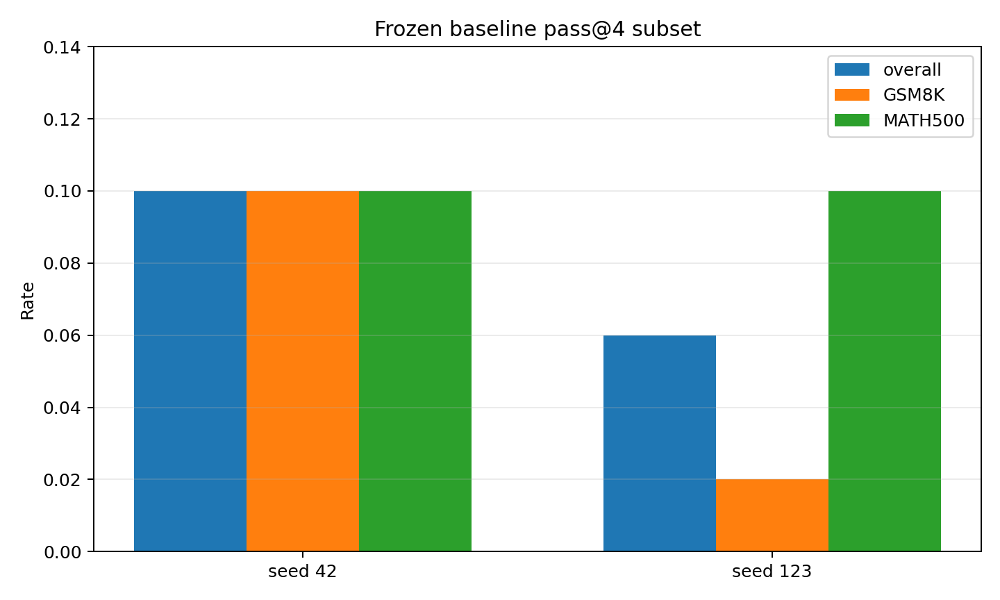
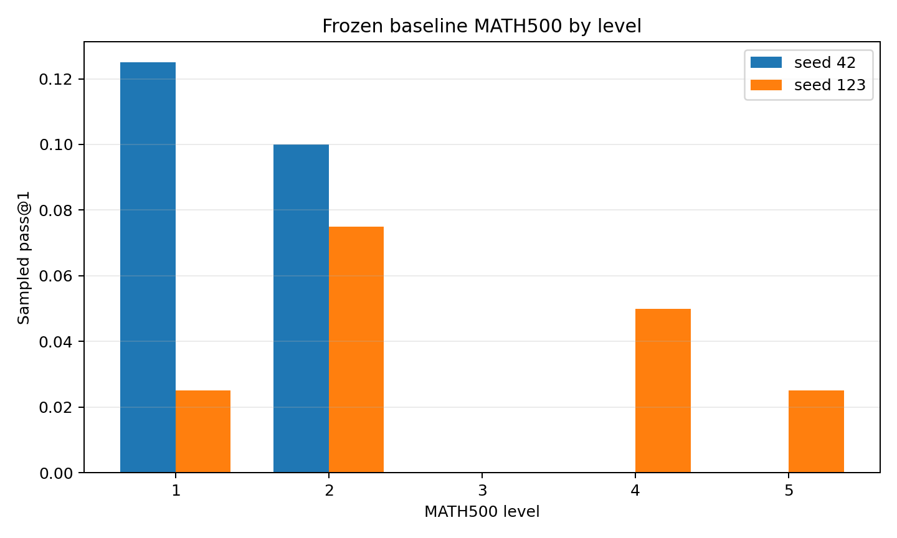
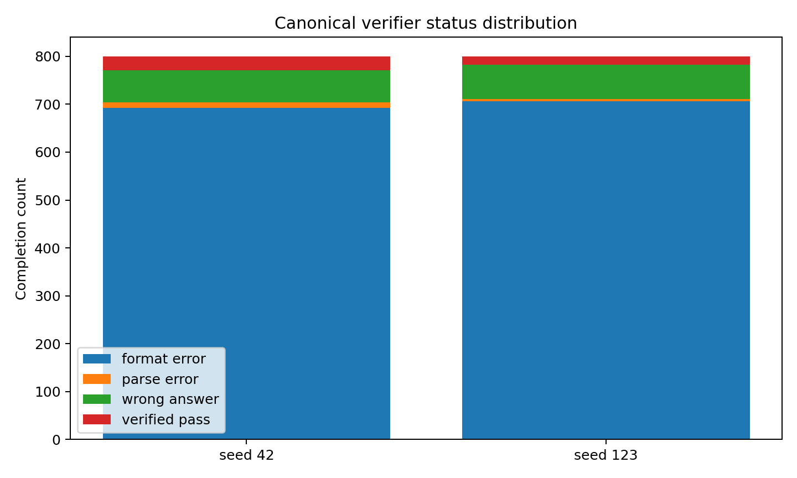
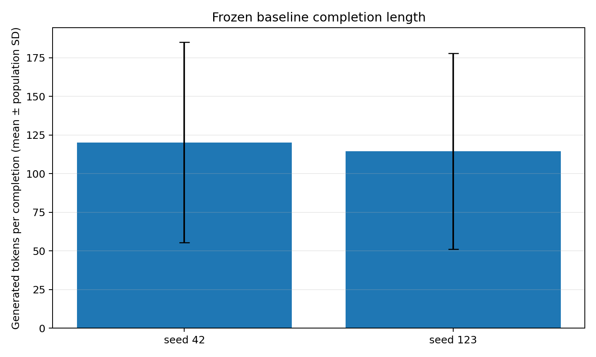
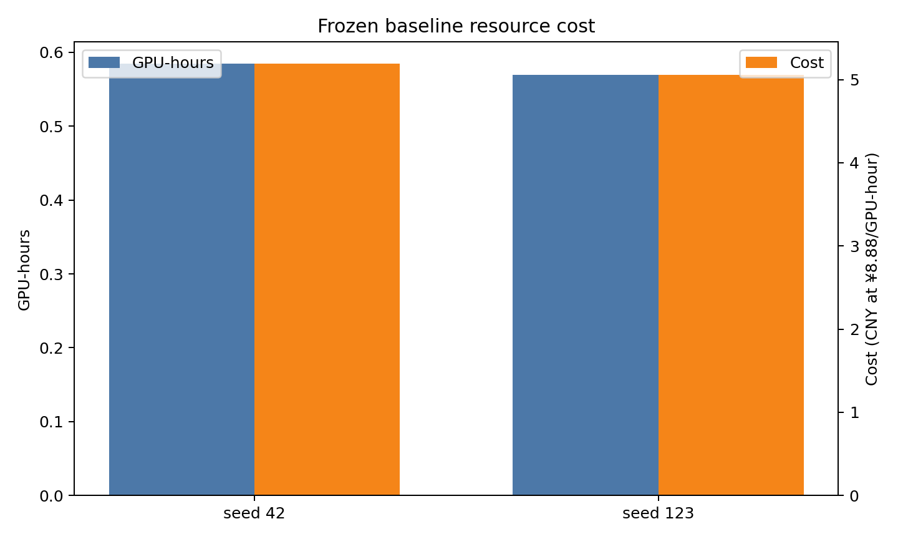

# Qwen 1.5B frozen baseline results

This report aggregates only the two successful post-amendment baseline runs. The two immutable engineering failures `baseline_formal_1p5b_seed42_20260718T114907Z` and `baseline_formal_1p5b_seed42_20260718T120909Z` are excluded.

The frozen protocol has no separate greedy completion, so greedy accuracy is `null/unavailable` with reason: `frozen protocol has no separate greedy completion`. Sampled pass@1 uses one sampled completion for all 400 problems. Pass@4 is the fraction with at least one canonical pass among four samples on the fixed 50 GSM8K + 50 MATH500 subset.

| Seed | Completions | Tokens | Sampled pass@1 | Pass@4 | GSM8K pass@1 | MATH500 pass@1 | Format | Valid answer | EOS | Truncated |
|---:|---:|---:|---:|---:|---:|---:|---:|---:|---:|---:|
| 42 | 800 | 96150 | 0.040 | 0.100 | 0.035 | 0.045 | 0.135 | 0.120 | 0.900 | 0.100 |
| 123 | 800 | 91651 | 0.025 | 0.060 | 0.015 | 0.035 | 0.117 | 0.111 | 0.922 | 0.077 |

Across seeds, sampled pass@1 is 0.0325 ± 0.0106 sample SD and pass@4 is 0.0800 ± 0.0283 sample SD. These two seeds quantify baseline sampling variation; they are not tuning observations.

## MATH500 levels

| Seed | Level | Problems | Sampled pass@1 | pass@4 subset problems | Pass@4 |
|---:|---:|---:|---:|---:|---:|
| 42 | 1 | 40 | 0.125 | 10 | 0.200 |
| 42 | 2 | 40 | 0.100 | 10 | 0.100 |
| 42 | 3 | 40 | 0.000 | 10 | 0.100 |
| 42 | 4 | 40 | 0.000 | 10 | 0.100 |
| 42 | 5 | 40 | 0.000 | 10 | 0.000 |
| 123 | 1 | 40 | 0.025 | 10 | 0.300 |
| 123 | 2 | 40 | 0.075 | 10 | 0.100 |
| 123 | 3 | 40 | 0.000 | 10 | 0.100 |
| 123 | 4 | 40 | 0.050 | 10 | 0.000 |
| 123 | 5 | 40 | 0.025 | 10 | 0.000 |

## Resources

Total wall time was 4154.8 seconds, 1.154103 GPU-hours, and ¥10.2484 at ¥8.88/GPU-hour. The maximum observed nvidia-smi memory was 3915 MiB; PyTorch allocator and nvidia-smi peaks remain separately reported in `metrics/resource_costs.csv`.

## Figures

*Sampled pass@1 on the frozen 400-problem evaluation set.*

*Pass@4 on the fixed 100-problem subset.*

*Sampled pass@1 by frozen MATH500 level.*

*Canonical completion-status counts; format failures are distinct from parseable wrong answers.*

*Mean generated completion tokens with population standard deviation.*

*Measured GPU-hours and cost at the frozen ¥8.88/GPU-hour rate.*
