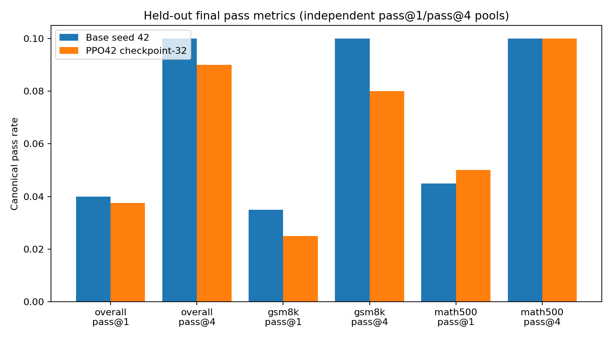
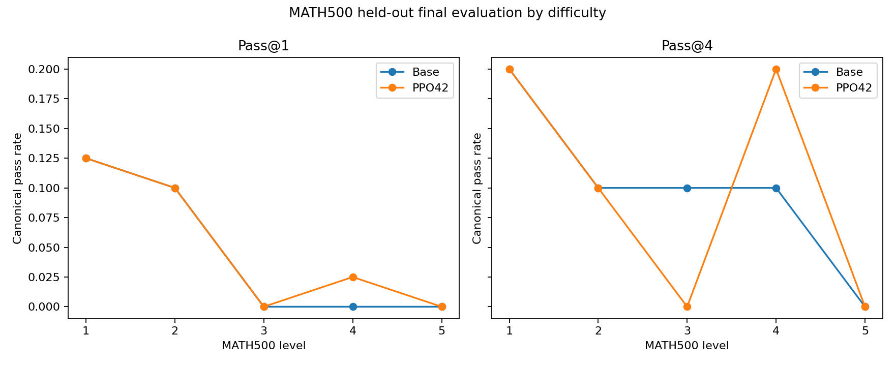
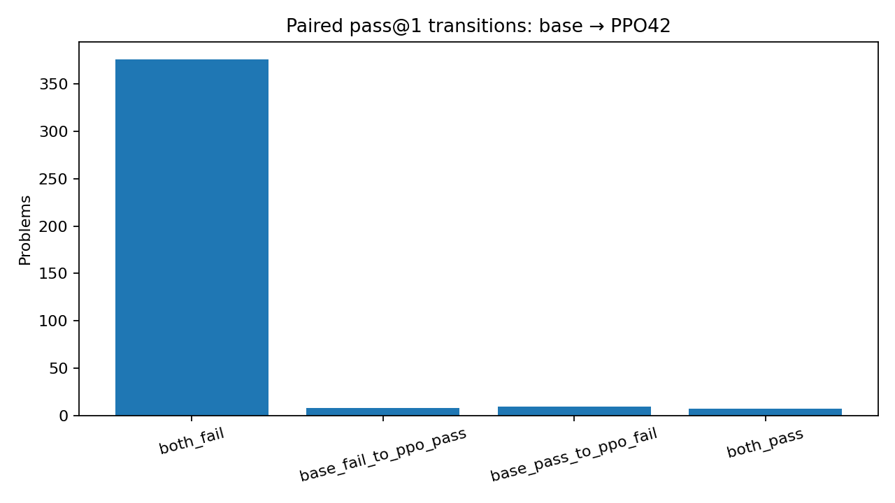
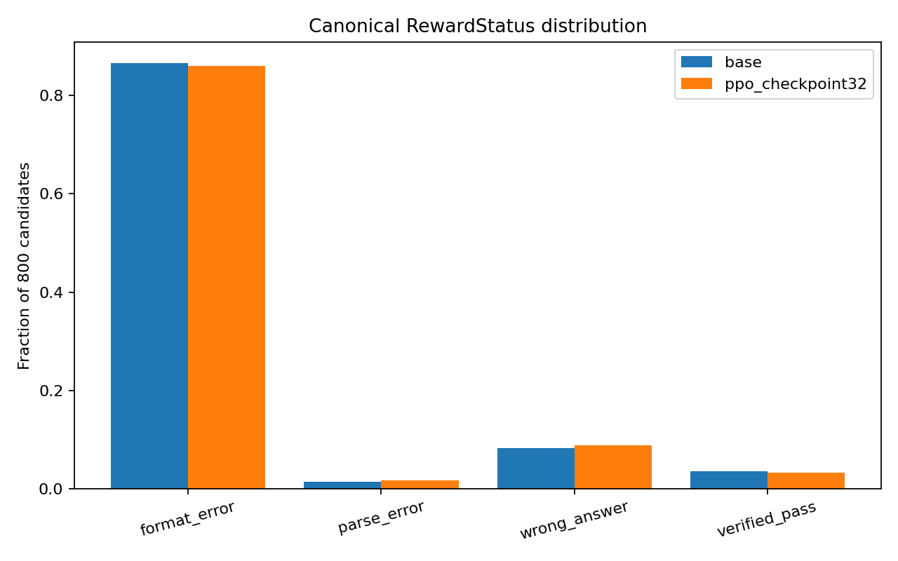
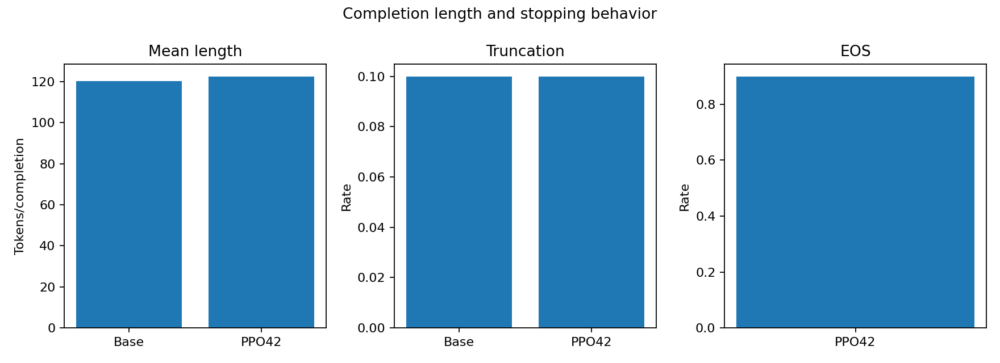
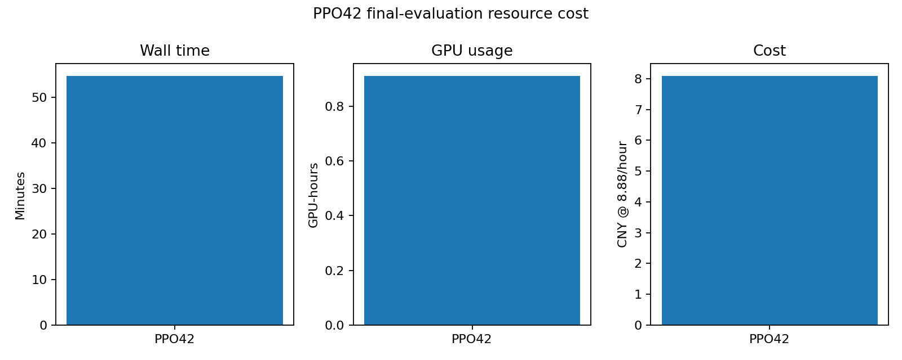

# PPO seed-42 fixed checkpoint-32 final evaluation

## Outcome

`ppo_final_formal_1p5b_seed42_20260721T022152Z` is the successful held-out final
evaluation of the fixed PPO seed-42 `checkpoint-32`. It completed 800/800 candidates
and 98,018 exact generated tokens. The evaluation loaded only the policy adapter for
generation; the PPO value adapter and scalar head were not loaded. Training, resume,
backward, optimizer, checkpoint selection, baseline rerun, and final evaluation of any
other algorithm/seed were all zero.

The checkpoint artifact-manifest SHA256 is
`18534747eb6bb1c0945676c7490fce29c90e1f67bff939bd9318ee1101ee1952`.
The model, revision, test manifests, prompt, reward, parser, verifier, sampling, and
256-token completion cap match the seed-42 base baseline. Step 32 was fixed before
training and was not selected from validation or test results.

## Pass-metric contract

The frozen test contains 200 GSM8K and 200 MATH500 problems. Sampled pass@1 uses one
candidate for each of all 400 problems: 15/400 = **3.75%**. Pass@4 uses a separate,
fixed 100-problem pool (50 GSM8K + 50 MATH500) with four candidates per problem:
9/100 groups contain at least one canonical pass, or **9.0%**. The pass@1 and pass@4
candidate pools are independent, not nested, so no per-problem `pass@4 >= pass@1`
assertion is made. Candidate seeds are the first eight SHA256 bytes of
`seed::pair_key`, interpreted as a big-endian integer.

Greedy accuracy is `null`, `available=false`, with reason
`frozen_protocol_has_no_separate_greedy_completion`; it is not reported as zero.
The machine-readable contract is in
[`ppo_seed42_final_pass_metric_contract.json`](ppo_seed42_final_pass_metric_contract.json).

## Held-out results

| Slice | pass@1 | pass@4 | Base pass@1 | Base pass@4 | PPO − Base pass@1 | PPO − Base pass@4 |
|---|---:|---:|---:|---:|---:|---:|
| Overall | 15/400 (3.75%) | 9/100 (9.0%) | 16/400 (4.0%) | 10/100 (10.0%) | -0.25 pp | -1.0 pp |
| GSM8K | 5/200 (2.5%) | 4/50 (8.0%) | 7/200 (3.5%) | 5/50 (10.0%) | -1.0 pp | -2.0 pp |
| MATH500 | 10/200 (5.0%) | 5/50 (10.0%) | 9/200 (4.5%) | 5/50 (10.0%) | +0.5 pp | 0.0 pp |
| MATH Level 1 | 5/40 (12.5%) | 2/10 (20.0%) | 5/40 (12.5%) | 2/10 (20.0%) | 0.0 pp | 0.0 pp |
| MATH Level 2 | 4/40 (10.0%) | 1/10 (10.0%) | 4/40 (10.0%) | 1/10 (10.0%) | 0.0 pp | 0.0 pp |
| MATH Level 3 | 0/40 (0.0%) | 0/10 (0.0%) | 0/40 (0.0%) | 1/10 (10.0%) | 0.0 pp | -10.0 pp |
| MATH Level 4 | 1/40 (2.5%) | 2/10 (20.0%) | 0/40 (0.0%) | 1/10 (10.0%) | +2.5 pp | +10.0 pp |
| MATH Level 5 | 0/40 (0.0%) | 0/10 (0.0%) | 0/40 (0.0%) | 0/10 (0.0%) | 0.0 pp | 0.0 pp |

The small Level-specific pass@4 denominators make ±10 percentage-point changes equal
to one problem. They are shown as raw evidence, not a broad difficulty claim.

## Paired base comparison

All 800 candidate keys matched the base seed-42 run on problem ID/hash, domain/level,
sample kind, candidate index, generation seed, prompt/parser/verifier identities,
sampling, and cap. Pass@1 had 8 base-fail → PPO-pass improvements, 9 base-pass →
PPO-fail regressions, 7 both-pass, and 376 both-fail problems. The paired delta is
-0.25 percentage points; the frozen 10,000-resample problem bootstrap 95% interval is
[-2.25, +1.75] points. The two-sided exact McNemar p-value is 1.0.

Pass@4 had 2 improvements, 3 regressions, 7 both-pass, and 88 both-fail groups. Its
paired delta is -1.0 point and bootstrap 95% interval is [-5.0, +3.0] points; the exact
McNemar p-value is 1.0. These analyses are descriptive and were not used for tuning or
checkpoint choice. They do not establish a significant effect or general PPO result.

Representative cases are selected mechanically: lexicographic `problem_id` order,
first five improvements and first five regressions. The published rule and complete
texts are in `metrics/ppo_seed42_final_representative_cases.csv`; cases were not chosen
for narrative appeal.

## Format, parseability, stopping, and errors

Across all 800 candidates, strict-format validity is 14.0%, the flat domain-valid
answer component rate is 24.5%, canonical parseability is 12.25%, and canonical pass
is 3.375%. The domain-valid component is an extracted-answer probe and is not the same
as canonical parseability. Among the 98 parseable candidates, 27 are canonical passes,
so accuracy given parseable is 27.551%.

Canonical status counts are 688 `FORMAT_ERROR`, 14 parse errors, 71 wrong answers, and
27 verified passes. Completion length is 122.523 tokens on average (population SD
65.331); EOS rate is 90.0% and truncation rate is 10.0%. All 80 capped candidates are
format errors, while the 720 non-truncated candidates contain 608 format errors, 14
parse errors, 71 wrong answers, and 27 passes. This association is reported as a
stopping/format diagnostic; a truncated format failure is not automatically labeled a
mathematical-reasoning failure.

GSM8K truncation is 0%, while MATH500 truncation is 20%. MATH500 Level 1–5 truncation
rates are 15.0%, 16.25%, 15.0%, 27.5%, and 26.25%. The exact-text duplicate rate within
the four-candidate pass@4 groups is 0/400 = 0%, so unique-completion rate is 100% under
that definition.

Detailed status/truncation tables are in
`metrics/ppo_seed42_final_status_distribution.csv` and
`metrics/ppo_seed42_final_error_analysis.csv`. Per-candidate evidence includes the
completion text, token IDs/mask, exact length, EOS/truncation, flat reward components,
canonical status/detail, candidate contribution, checkpoint link, and a prompt SHA
reconstructed CPU-only from the frozen renderer and exact local tokenizer.

## Resources and artifact integrity

Total evaluation wall time was 3,280.502 seconds (54m40.5s), yielding 29.879 generated
tokens/s over the monitored evaluation wall. Peak PyTorch allocated/reserved memory
was 3,107.33/3,322 MiB; peak nvidia-smi memory was 3,933 MiB and mean sampled GPU
utilization was 34.342%. Usage was 0.911251 GPU-hours and CNY 8.091905 at CNY
8.88/GPU-hour.

The runtime does not separate model/adapter load time from generation wall time, so
both submetrics are `null/unavailable` with reason
`runtime_monitor_does_not_separate_load_and_generation`; the measured total is retained.
Worker pre-exit allocator residue is a warning only. After process exit, nvidia-smi was
0 MiB with no compute process.

The complete run is under
`/root/autodl-tmp/runs/math_rlvr/ppo_final_formal_1p5b_seed42_20260721T022152Z`.
All 20 run checksum entries passed. Its verified persistent archive is
`/root/autodl-fs/math-rlvr-backups/ppo_final_formal_1p5b_seed42_20260721T022152Z.tar.gz`,
SHA256 `04fcb03b22ab74e865e2627c0e02460b62c6c731e2245d054aefe5ff6b562fc1`.

The first authorized process, `ppo_final_formal_1p5b_seed42_20260720T052931Z`, was
terminated by a host power/network outage after 429 rows and 41,144 tokens. It is
immutable, excluded from scientific statistics, and was neither resumed nor joined to
the successful run. Its persistent failure-evidence archive SHA256 is
`498f0a33696cd3aed77a6d2e9f7fc02e1515fcf624f51aef023b5b12dcc65e21`.

## Interpretation and next boundary

The fixed PPO42 policy is essentially tied with its matching base seed under this
single-seed held-out protocol: pass@1 is 0.25 points lower and pass@4 is 1 point lower,
with paired intervals spanning zero. MATH500 pass@1 is 0.5 points higher while GSM8K
is 1 point lower. These raw results do not support a general improvement claim.

The next queue position is GRPO seed-42 checkpoint-32 final evaluation. It requires a
separate explicit authorization. This stage did not launch it or any seed-123 final
evaluation.
