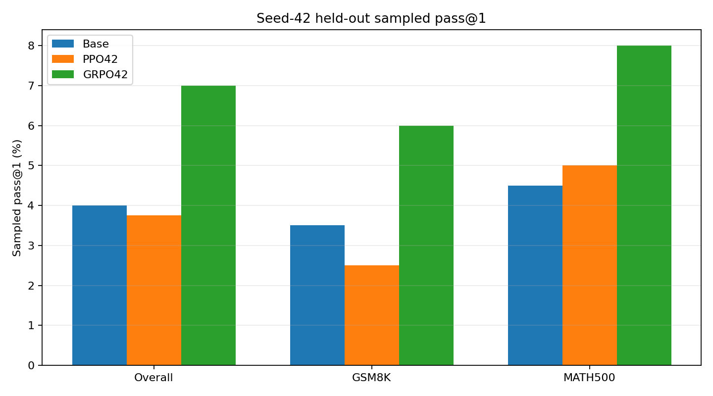
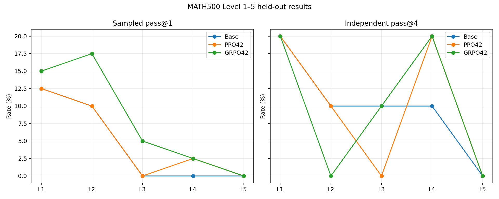
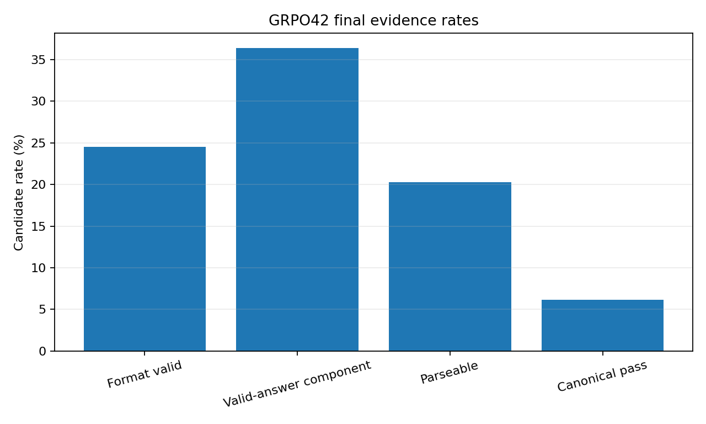
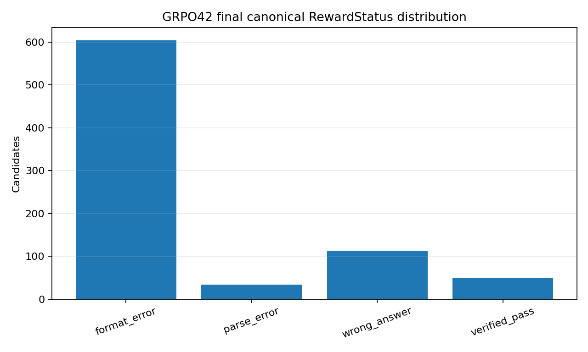
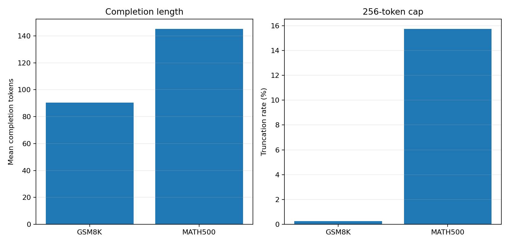
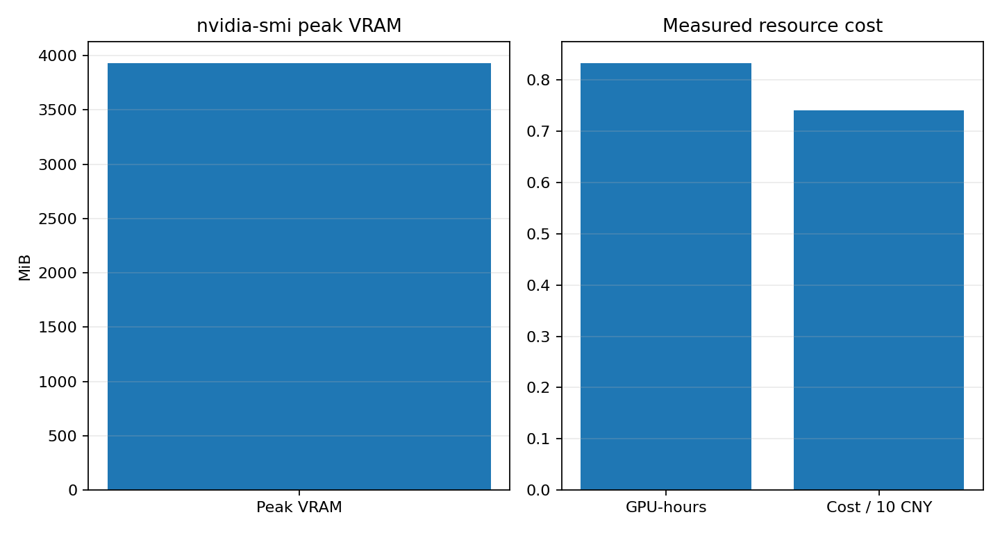

# GRPO seed-42 fixed checkpoint-32 final evaluation

## Outcome

`grpo_final_formal_1p5b_seed42_20260721T034104Z` is the successful held-out final
evaluation of the fixed GRPO seed-42 `checkpoint-32`. It completed 800/800 candidates
and 94,288 exact generated tokens. Only the GRPO policy adapter was loaded. Training,
resume, backward, optimizer, checkpoint selection, baseline/PPO reruns, and any
seed-123 evaluation were all zero.

The checkpoint artifact-manifest SHA256 is
`c0c1a3dc04b28d8d42463009b728b3ffd144e677c35e5d3ace2749fc925fa65a`.
The model, revision, test manifests, prompt, reward, parser, verifier, sampling, and
256-token completion cap match the seed-42 base and PPO evaluations. Step 32 was fixed
before training and was not selected from validation or test results.

## Pass-metric contract

Sampled pass@1 uses one candidate for each of 200 GSM8K and 200 MATH500 problems:
28/400 = **7.0%**. Independent pass@4 uses a separate fixed pool of 50 GSM8K and
50 MATH500 problems, with four candidates each: 14/100 groups contain at least one
canonical pass, or **14.0%**. The pools are independent rather than nested, so no
per-problem `pass@4 >= pass@1` assertion is made. Candidate seeds are derived from the
first eight SHA256 bytes of `seed::pair_key` as a big-endian integer.

Greedy accuracy is `null`, `available=false`, reason
`frozen_protocol_has_no_separate_greedy_completion`; it is not reported as zero. The
complete contract is in
[`grpo_seed42_final_pass_metric_contract.json`](grpo_seed42_final_pass_metric_contract.json).

## Held-out results

| Slice | GRPO pass@1 | GRPO pass@4 | Base pass@1 | Base pass@4 | PPO pass@1 | PPO pass@4 |
|---|---:|---:|---:|---:|---:|---:|
| Overall | 28/400 (7.0%) | 14/100 (14.0%) | 16/400 (4.0%) | 10/100 (10.0%) | 15/400 (3.75%) | 9/100 (9.0%) |
| GSM8K | 12/200 (6.0%) | 9/50 (18.0%) | 7/200 (3.5%) | 5/50 (10.0%) | 5/200 (2.5%) | 4/50 (8.0%) |
| MATH500 | 16/200 (8.0%) | 5/50 (10.0%) | 9/200 (4.5%) | 5/50 (10.0%) | 10/200 (5.0%) | 5/50 (10.0%) |
| MATH Level 1 | 6/40 (15.0%) | 2/10 (20.0%) | 5/40 (12.5%) | 2/10 (20.0%) | 5/40 (12.5%) | 2/10 (20.0%) |
| MATH Level 2 | 7/40 (17.5%) | 0/10 (0.0%) | 4/40 (10.0%) | 1/10 (10.0%) | 4/40 (10.0%) | 1/10 (10.0%) |
| MATH Level 3 | 2/40 (5.0%) | 1/10 (10.0%) | 0/40 (0.0%) | 1/10 (10.0%) | 0/40 (0.0%) | 0/10 (0.0%) |
| MATH Level 4 | 1/40 (2.5%) | 2/10 (20.0%) | 0/40 (0.0%) | 1/10 (10.0%) | 1/40 (2.5%) | 2/10 (20.0%) |
| MATH Level 5 | 0/40 (0.0%) | 0/10 (0.0%) | 0/40 (0.0%) | 0/10 (0.0%) | 0/40 (0.0%) | 0/10 (0.0%) |

The Level pass@4 denominators are only ten problems, so a one-problem change is ten
percentage points. These are raw strata, not broad difficulty claims.

## Format, parseability, stopping, and diversity

Across all 800 candidates, strict-format validity is 196/800 (24.5%), the flat
domain-valid answer component is positive for 291/800 (36.375%), canonical parseability
is 162/800 (20.25%), and canonical pass is 49/800 (6.125%). The valid-answer component
is an extracted-answer reward probe and is not equivalent to canonical parseability.
Among the 162 parseable candidates, 49 pass, so accuracy given parseable is 30.247%.

Canonical statuses are 604 `FORMAT_ERROR`, 34 parse errors, 113 wrong answers, and
49 verified passes. Completion length is 117.860 tokens on average (population SD
63.185); EOS rate is 92.0% and truncation is 64/800 (8.0%). Every truncated candidate
is a format error. GSM8K truncation is 1/400 (0.25%); MATH500 is 63/400 (15.75%).
MATH500 Levels 1–5 have truncation rates of 10.0%, 10.0%, 12.5%, 25.0%, and 21.25%.
Truncation co-occurrence is a stopping/format diagnostic and is not automatically a
mathematical-reasoning failure.

There are zero repeated exact texts within the 100 independent four-candidate groups:
duplicate rate 0/400 and unique-completion rate 100%. The original runtime summary's
generic `valid_answer_rate` is the canonical-valid-answer/parseability boolean (20.25%);
this report uses the frozen, explicitly named flat `valid_answer_component > 0` metric
(36.375%) and retains both definitions instead of relabeling either value.

## Resources and integrity

Measured evaluation wall time was 3,001.050 seconds (50m01.1s), or 31.418 generated
tokens/s over the monitored wall. Peak PyTorch allocated/reserved memory was
3,107.33/3,322 MiB; peak nvidia-smi memory was 3,933 MiB and mean sampled GPU
utilization was 35.627%. Usage was 0.833625 GPU-hours and CNY 7.402591 at CNY
8.88/GPU-hour.

The runtime does not separately expose model/adapter load time or generation-only wall
time; both are `null`, `available=false`, reason
`runtime_monitor_does_not_separate_load_and_generation`. The measured total remains
available. Worker pre-exit allocator residue is a warning; after process exit,
nvidia-smi reported 0 MiB and no compute process.

All 20 runtime checksum entries passed. The full run is at
`/root/autodl-tmp/runs/math_rlvr/grpo_final_formal_1p5b_seed42_20260721T034104Z`.
The verified persistent archive is
`/root/autodl-fs/math-rlvr-backups/grpo_final_formal_1p5b_seed42_20260721T034104Z.tar.gz`,
SHA256 `97be0c2f1931690fb631dec557eb17201df12b177810c0b270192c46e6920e48`.

## Interpretation and boundary

On this fixed seed/test/candidate protocol, GRPO42 is 3.0 percentage points above Base
and 3.25 points above PPO42 on sampled pass@1; independent pass@4 is 4 and 5 points
higher. The paired pass@1 results are positive on this fixed problem universe, while
both pass@4 intervals span zero. One training seed does not establish cross-seed
stability, causality, or a general GRPO advantage. The detailed paired analysis is in
[`13_seed42_final_comparison.md`](13_seed42_final_comparison.md).

The next frozen queue position is GRPO seed-123 checkpoint-32 held-out final evaluation.
It requires separate authorization. This stage did not launch it, PPO123, or seed2026.
