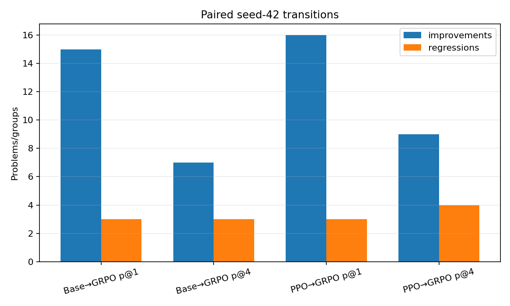

# Seed-42 held-out Base vs PPO vs GRPO comparison

## Comparison contract

The three successful runs share all 800 candidate keys and the same problem IDs/hashes,
prompt, parser, verifier, reward, sampling seeds/indices, and 256-token cap:

- Base: `baseline_formal_1p5b_seed42_20260718T125833Z`
- PPO: `ppo_final_formal_1p5b_seed42_20260721T022152Z`
- GRPO: `grpo_final_formal_1p5b_seed42_20260721T034104Z`

Sampled pass@1 is paired only over its 400 single-candidate problems. Independent
pass@4 is paired only over its separate 100 four-candidate problem groups. No candidate
or problem is compared across those two pools. All comparisons are post-run CPU
analysis and were not used for training, checkpoint selection, or tuning.

## Aggregate results

| Model | sampled pass@1 | independent pass@4 | exact tokens |
|---|---:|---:|---:|
| Base | 16/400 (4.0%) | 10/100 (10.0%) | 96,150 |
| PPO42 checkpoint-32 | 15/400 (3.75%) | 9/100 (9.0%) | 98,018 |
| GRPO42 checkpoint-32 | 28/400 (7.0%) | 14/100 (14.0%) | 94,288 |

GRPO minus Base is +3.0 points for pass@1 and +4.0 for independent pass@4. GRPO minus
PPO is +3.25 and +5.0 points respectively. Dataset/level integer numerators and
denominators are in `metrics/seed42_final_comparison_metrics.csv`.

## Base vs GRPO paired results

For sampled pass@1, 15 problems change from Base fail to GRPO pass, 3 change from Base
pass to GRPO fail, 13 are both-pass, and 369 are both-fail. The paired delta is +3.0
points; the frozen 10,000-resample problem bootstrap 95% interval is [+1.0, +5.0]
points. The two-sided exact McNemar p-value is 0.00754.

For independent pass@4, 7 groups improve, 3 regress, 7 are both-pass, and 83 are
both-fail. The delta is +4.0 points, bootstrap interval [-2.0, +10.0], and exact
McNemar p-value 0.34375.

## PPO vs GRPO paired results

For sampled pass@1, 16 problems change from PPO fail to GRPO pass, 3 change from PPO
pass to GRPO fail, 12 are both-pass, and 369 are both-fail. The paired delta is +3.25
points; the bootstrap interval is [+1.25, +5.5] points. The exact McNemar p-value is
0.00443.

For independent pass@4, 9 groups improve, 4 regress, 5 are both-pass, and 82 are
both-fail. The delta is +5.0 points, bootstrap interval [-2.0, +12.0], and exact
McNemar p-value 0.26685.

## What the evidence supports

The paired pass@1 evidence supports a positive GRPO42 association on this exact frozen
seed-42 test candidate set: both paired intervals exclude zero and discordant counts
favor GRPO. It does not establish that GRPO generally outperforms PPO across training
seeds, sampling realizations, or mathematical populations. The pass@4 evidence is more
uncertain: both intervals include zero and the exact paired tests are not small. The
Level denominators are also too small for broad difficulty claims.

These are paired descriptive/inferential summaries of one training seed, not a claim of
cross-seed statistical significance. GRPO123 and PPO123 held-out evaluations remain
unrun, and no frozen scientific variable was changed in response to these results.

## Error taxonomy and case selection

On the 400 pass@1 problems, the mechanically derived categories include:

- Base wrong, PPO wrong, GRPO right: 10.
- Base right, PPO and GRPO wrong: 3.
- PPO right, GRPO wrong: 3.
- PPO wrong, GRPO right: 16.
- all three wrong: 366.
- all three right: 7.

Across all 800 GRPO candidates, 64 truncated format failures, 113 parseable wrong
answers, zero canonical `INVALID_NUMBER_USAGE` statuses, and 113 high-partial-reward
but canonical-wrong candidates were observed. “High partial reward” is frozen here as
`scalar_reward >= 0.20` with `canonical_correct=false`; it identifies reward-shaping
error-analysis cases, not reward hacking by itself.

Representative rows use a mechanical rule: lexicographic problem/pair key order, first
five per category. The complete category counts, selected texts, and all paired rows are
in `metrics/grpo_seed42_final_representative_cases.csv`,
`metrics/grpo_seed42_final_error_analysis.csv`, and
`metrics/seed42_final_paired_comparison.csv`. Cases were not selected to favor GRPO.

## Resource context

GRPO42 final evaluation used 0.833625 GPU-hours and CNY 7.402591, versus PPO42's
0.911251 GPU-hours and CNY 8.091905. This is an observed single-run resource comparison,
not a throughput guarantee. Both post-process GPU checks were 0 MiB with no compute
process.

No test result in this comparison was used to change a checkpoint, prompt, reward,
sampling rule, or training configuration.
