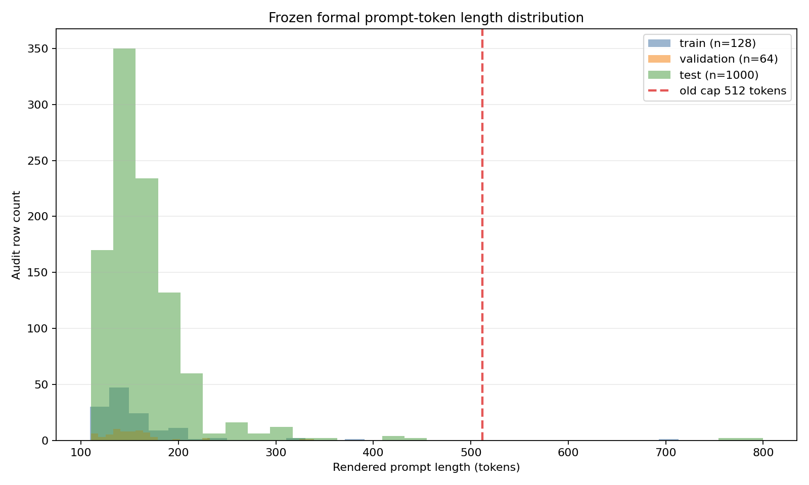

# Formal 1.5B prompt-length audit

- Scope: post-freeze CPU-only capacity audit using the pinned local Qwen 1.5B tokenizer.
- Tokenizer snapshot: `/root/autodl-tmp/cache/huggingface/hub/models--Qwen--Qwen2.5-1.5B-Instruct/snapshots/989aa7980e4cf806f80c7fef2b1adb7bc71aa306`
- Prompt renderer/version: `math_rlvr.prompt.chat_template.v1` / `prompt_v2_formal_math`
- Audit rows: 1192 across training, validation, baseline pass@1/pass@4, and final pass@1/pass@4 modes.
- Unique frozen problem IDs: 592.
- Current prompt cap: 512 tokens; max completion length: 256 tokens.
- Tokenizer model max length: 131072; model max context: 32768.
- Tokenization used `truncation=False`; no audited prompt was truncated.

## Maximum lengths

- Overall: **800** tokens (`math:HuggingFaceH4/MATH-500:test:219`).
- Train: 713; validation: 339; test: 800.
- GSM8K: 262; MATH500: 800.
- MATH500 levels: Level 1=279, Level 2=257, Level 3=415, Level 4=800, Level 5=767.
- Failed-run sample `math:HuggingFaceH4/MATH-500:test:219`: **800 tokens**.

## Current-cap violations

- Unique over-limit problems: 3.
- `math:DigitalLearningGmbH/MATH-lighteval:train:2713`
- `math:HuggingFaceH4/MATH-500:test:168`
- `math:HuggingFaceH4/MATH-500:test:219`

## Context safety

- Observed maximum prompt + 256 completion tokens: 1056.
- This is below the model context limit 32768 by 31712 tokens.
- Increasing only the prompt capacity cap does not change rendered text or token IDs for any prompt.

*Figure: Distribution reconstructed exclusively from `metrics/prompt_length_audit.csv`; dashed line is the pre-amendment 512-token cap.*
